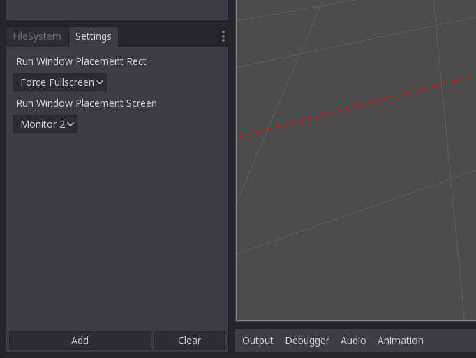

# Quickset Godot Plugin

Ever find yourself having to change some editor settings often but find the whole
process too tedious? If yes, then this plugin will allow you expose your favorite 
settings into a separate dock for quick access.

## Work in progress!

This plugin was created in the dire need to expose some specific editor settings 
that I toggle quite often. 
Adding some settings will work, but some won't.

### To-do

- [ ] Support more editor settings data types.
- [ ] Ability to expose project settings as well as editor settings.
